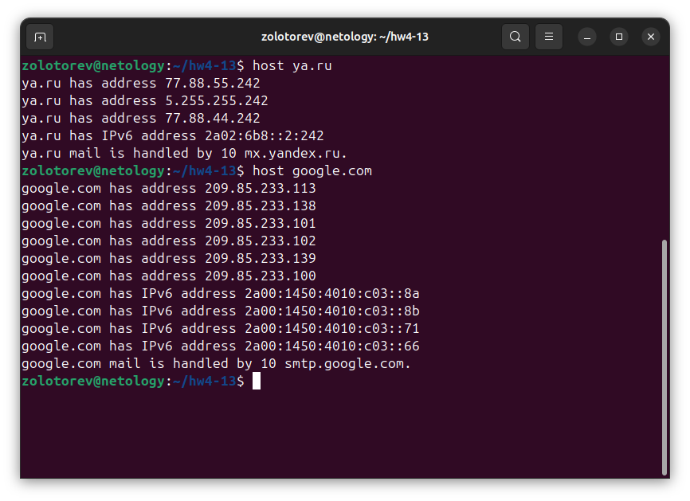

# Домашнее задание к занятию "4.13. IPv6"

### Золоторев Н.Д.

### Задание 1

Какая нотация используется для записи IPv6-адресов:

    какие и сколько символов?
    какие разделители?

Приведите ответ в свободной форме.

### Решение 1

Для записи IPv6-адресов используется шестнадцатеричная нотация.Адрес состоит из 128 битов, которые записываются как восемь групп по четыре шестнадцатеричных цифры. Для представления значений используются числа 0–9 и буквы A–F. 
Разделители групп — двоеточие. 

### Задание 2

Какой адрес используется в IPv6 как loopback?

Приведите ответ в свободной форме.

### Решение 2

0:0:0:0:0:0:0:1 — адрес, который используется в IPv6 как loopback.

Также он может быть представлен в формате ::1. 

### Задание 3

Что такое Unicast, Multicast, Anycast адреса?

Приведите ответ в свободной форме.

### Решение 3

Адрес Unicast (индивидуальный адрес) — единичный адрес, который идентифицирует только один сетевой интерфейс. Протокол IPv6 доставляет пакеты, отправленные на такой адрес, на конкретный интерфейс.

Multicast (групповой адрес) — это передача данных от одного отправителя сразу нескольким получателям, входящим в определённую группу. 

Адрес Anycast — адрес, который назначается группе интерфейсов, обычно принадлежащих различным узлам. Пакет, отправленный на такой адрес, доставляется на один из интерфейсов данной группы, как правило, наиболее близкий к отправителю с точки зрения протокола маршрутизации. 

### Задание 4

Используя любую консольную утилиту в Linux, получите IPv6-адрес для какого либо ресурса.

В качестве ответа приложите скриншот выполнения команды.

### Решение 4

### Задание 5

    Как выглядят IPv6-адреса, которые маршрутизируются в интернете?
    Как выглядят локальные IPv6 адреса?

### Решение 5

IPv6-адреса, маршрутизируемые в интернете, имеют глобальный формат и начинаются с определённых префиксов, например,

2000::/3. Они выглядят как 8 групп по 4 шестнадцатеричных символа, разделённых двоеточиями, например: 
2001:0db8:85a3:0000:0000:8a2e:0370:7334

Локальные IPv6-адреса начинаются с префикса
fe80::/10, например: fe80:0000:0000:0000:3141:a5b2:23a1:b152.
